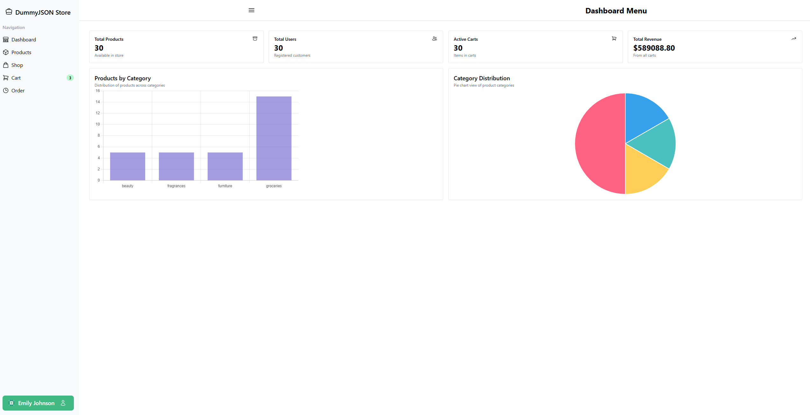
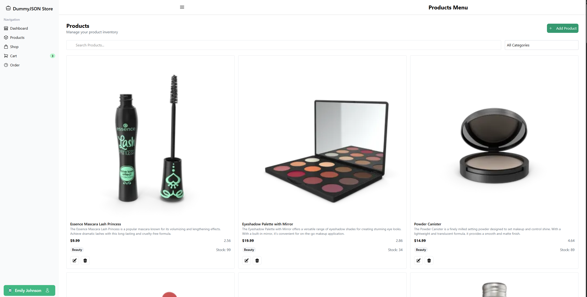
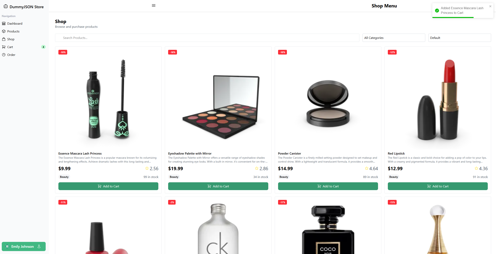
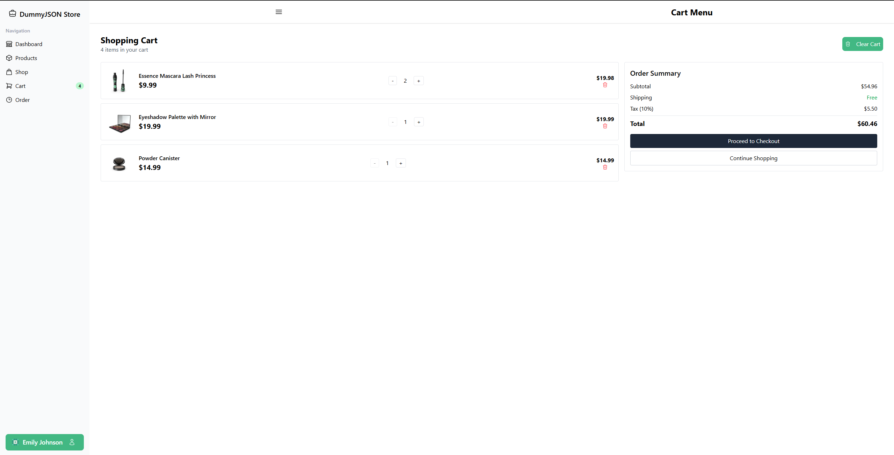
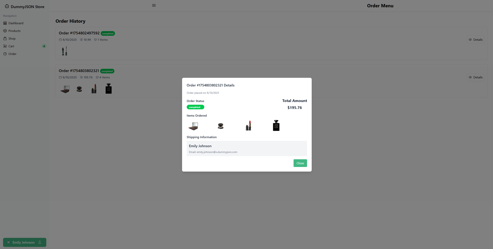

# Vue 3 + TypeScript + Vite

Vue ERP Demo
A modern ERP dashboard built with Vue 3, TypeScript, Vite, Tailwind CSS, and Chart.js.
It demonstrates e-commerce analytics including products, users, carts, and revenue in a responsive interface.

## Features

Login flow + protected dashboard with Vue Router
Sidebar & Header UI built with Tailwind CSS
Static charts powered by vue-chartjs and Chart.js
Data fetching via composables (useGetProductsList, useGetUsersInfo, useGetCartItems)
Reactive state management with Pinia
Invoice-worthy UX for managing products, users, carts, etc.

## Getting Started
Prerequisites
Node.js (≥ v16), npm or yarn

git clone <repo-url>
cd vue-erp-demo
npm install
npm run dev

## Technologies Used
Vue 3 (Composition API + <script setup>)
TypeScript for type safety
Tailwind CSS for utility-first styling
Heroicons & Headless UI for UI elements
vue-chartjs + Chart.js for data visualizations
Pinia for reactive state management
Vite for blazing-fast development
axios for API calls (wrapped in composables)

## API Endpoints
| Resource | Endpoint    | Example                          |
| -------- | ----------- | -------------------------------- |
| Products | `/products` | `https://dummyjson.com/products` |
| Users    | `/users`    | `https://dummyjson.com/users`    |
| Carts    | `/carts`    | `https://dummyjson.com/carts`    |

## Overview

